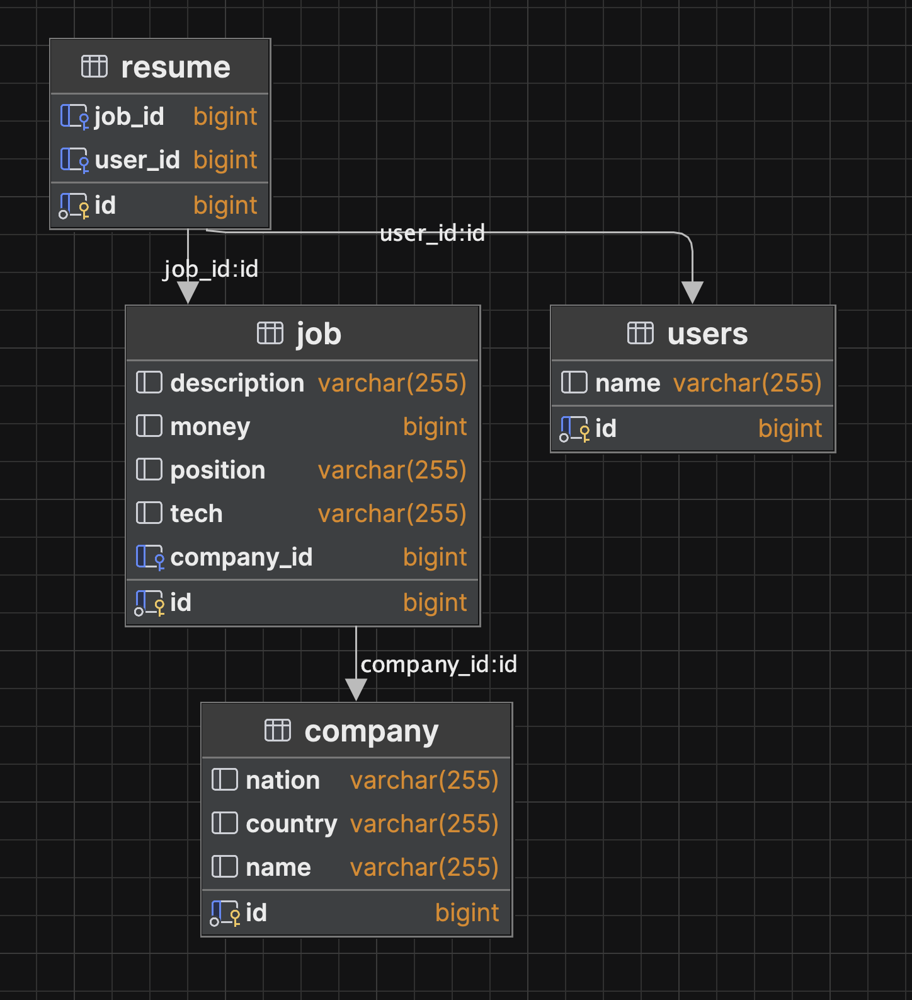
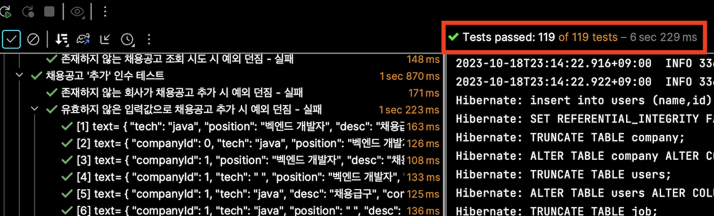

# wanted-pre-onboarding-backend

## 요구사항 분석

알아둘 것  
구현을 명확하게 하고자, 구현 요구사항에 언급되지 않은 것들에 대해서는 '명시X' 라는 표현을 사용하여
자체적인 요구사항 해석을 가미하여 분석하였습니다.

* **회사**는 <u>회사명</u>, <u>국가</u>, <u>지역</u>에 대한 정보를 가지고 있습니다.  
* **회사**는 하나 또는 그 이상의 **채용공고**를 등록할 수 있습니다.  
* 각 **회사**는 회사의 고유의 <u>번호</u>로 다른 회사와 구별될 수 있습니다.  
* **채용공고**에는 <u>채용포지션</u>, <u>채용보상금</u>, <u>채용내용</u>, <u>사용기술</u>이 반드시 들어가야합니다.
* **사용자**는 고유 <u>번호</u>로 다른 사용자와 구별되며 <u>이름</u>을 포함하고 있습니다.
* **사용자**는 회사의 **특정 채용공고**에 지원할 수 있습니다.
* **채용공고**는 채용번호로 구별됩니다.

## ERD

## 사전에 저장되는 데이터
`사용자` 와 `회사` 의 데이터는 애플리케이션 실행시점에 딱 한번 데이터베이스에 저장하도록 하였습니다.
#### 사용자
| 사용자번호 |   이름   |
|:-----:|:------:|
|   1   | wanted |
|   2   |  june  |

#### 회사
| 회사번호 |  회사명   | 국가 | 지역 |
|:----:|:------:|:--:|:--:|
|  1   |  원티드랩  | 한국 | 서울 |
|  2   |  네이버   | 한국 | 판교 |
|  3   | 원티드코리아 | 한국 | 부산 |
|  4   |  카카오   | 한국 | 판교 |

## EndPoint
| NO |   NAME    |  METHOD  |          URL          |     PARAM1     | PARAM2 | PARAM3 |
|:--:|:---------:|:--------:|:---------------------:|:--------------:|:-------:|:-------:|
| 1  |  채용공고 작성  |  `POST`  |     /api/v1/jobs      |
| 2  |  채용공고 조회  |  `GET`   | /api/v1/jobs/{job_id} |
| 3  |  채용공고 수정  | `PATCH`  | /api/v1/jobs/{job_id} |
| 4  |  채용공고 삭제  | `DELETE` | /api/v1/jobs/{job_id} |
| 5  | 채용공고 목록조회 |  `GET`   |     /api/v1/jobs      | search(string) |page(int)|size(int)|
| 6  |  채용공고 지원  |  `POST`  |     /api/v1/apply     |

## 테스트

테스트의 경우 유닛테스트로 작성하였습니다.
1. 요청객체를 생성하는 부분
2. 도메인 테스트
3. 애플리케이션 레벨 테스트
4. 인수 테스트

마지막 인수테스트만 독립적인 데이터베이스 컨테이너를 띄어 테스트를 진행하고,
나머지 테스트의 경우 h2 데이터베이스로 테스트를 진행하였습니다.

### 결과
인수테스트 가운데, 
검색 관련한 테스트는 미처 진행하지 못했습니다. 참고바랍니다.

